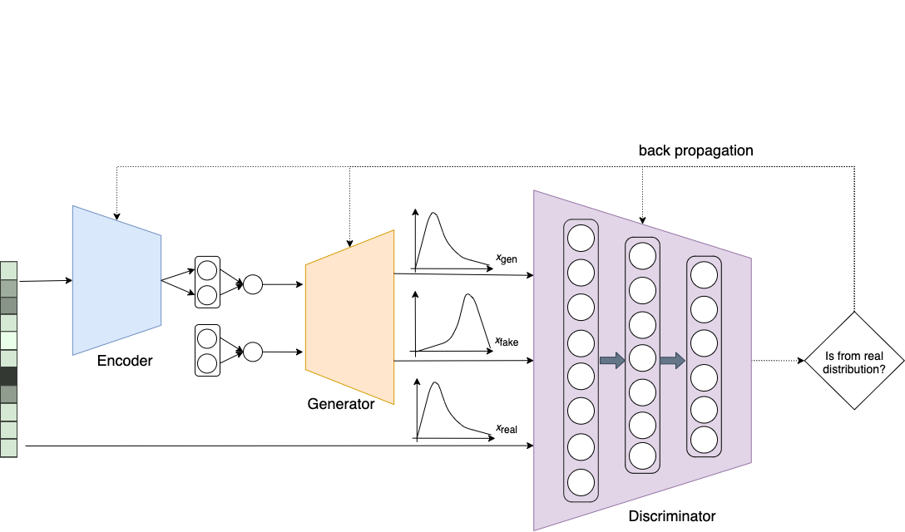

# GA-ATAC

## Overview

This repository contains the PyTorch implementation for Geneartive Adversarial ATAC (GA-ATAC) clutering. The network structure is:



## Dependencies
    + pysam==0.15.4
    + python-louvain==0.14
    + scipy==1.1.0
    + torch==1.3.0
    + tqdm==4.28.1
    
## Usage
    ```python3.7 main.py --dataset=GM12878vsHL --n_hidden=512 --n_latent=24 --min_peaks=0 --min_cells=0.0 --max_cells=1.0```
    
    
## References

[1] Lopez, R., Regier, J., Cole, M. B., Jordan, M. I. & Yosef, N. Deep generative modeling for single-cell transcriptomics. Nat. Methods 15, 1053–1058 (2018).
    
    
## Cite

Please cite our paper if you use this code in your own work:


